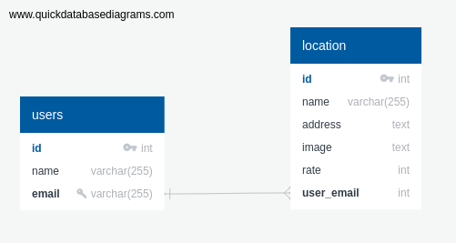

# test-your-taste
website to show locations for resturants.

## TEAM NAMES:
- Hashem Taha
- Rana Obeid 
- Mohammad Alhalaq 
- Asmaa Thabet

## Our Idea : 
  a Website that display all the locations saved in our website database and added new location .

## WHY ? 
  we make this website to display data from postgres database and to insert new data to it . 

## HOW?
We divided our project in to Stages:
 
* analyze project :
  we started our work by analyzing user journey and making database schema for the project.

* Design :  
  We design our project on papers to make a general perception for the website.

* Project Structure : 
  We started to build our project files Structure by seprate our project into three folders which is public,src and test to make our work more organized.

* Setup Travis in our project : 
  We setup travis in the begining of our project 
to test our project with its test step by step and we add new local database for travis   .  

* Divided Tasks :
  We divided the work in tasks and started to work as pair in every task.

* making tests : 
  we made tests for our routes and database to check that they were work well .

* making sql file : 
  make our database file to store schema in it .

* Displaying Data In Page : 
  We show our data  from database by using select queries and adding an add button to add new location .

* Design Website : 
  We make simple design for our website to obtain the required shape from our idea .

* Use Heroku :
  we use our Heroku to connect it with github and have a link to our project . 

* checking and Fixing issues : 
  Solve The issues that appears and take suggestions in mind and try to add it all to have a great website . 

## User Journey
* The User enter our Website and see list of locations.
* The User can add new location by typing its informations .

## Schema digram:

